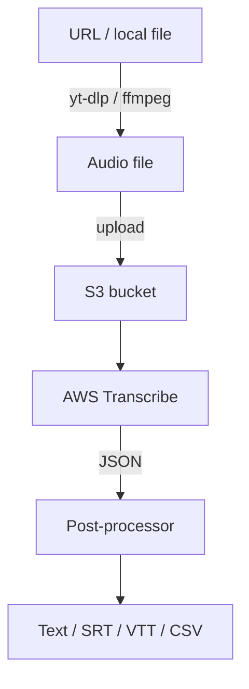

# RustScribe

<div align="center">
  
</div>

[](https://github.com/yourusername/rustscribe/actions/workflows/release.yml)
[](https://crates.io/crates/rustscribe)
[](LICENSE)


> **CLI to turn YouTube, Twitter/X or local media into timestamped, speaker‑labelled transcripts in one command.**
> Runs on Rust and **AWS Transcribe** (⚠️ AWS usage fees apply after the free tier).

---

## ✨ Features

|                                |                                                                             |
| ------------------------------ | --------------------------------------------------------------------------- |
| 🎥 **Multi‑source fetchers**   | YouTube, Twitter/X, any direct media URL, local audio/video files           |
| 🤖 **Cloud‑grade ASR**         | Uses AWS Transcribe Batch API for high‑accuracy speech recognition          |
| 👥 **Speaker labels**          | Detects 2 – 10 speakers when `--speaker-labels` is on                       |
| ⏱ **Timestamps**               | Fine‑grained timing (`--timestamps` or millisecond `--detailed-timestamps`) |
| 🗃 **Multiple output formats** | text, JSON, SRT, VTT, CSV                                                   |
| 📦 **Pre‑built binaries**      | Linux x86_64/arm64, macOS x86_64/arm64, Windows x86_64                   |

---

## 🚀 Quick start

```bash
# 1. install (choose one)
cargo install rustscribe                # builds from source
# or download a binary from Releases page and place it in $PATH

# 2. configure AWS (one‑time)
mkdir -p ~/.config/rustscribe && \
cp config.example.yaml ~/.config/rustscribe/config.yaml
$EDITOR ~/.config/rustscribe/config.yaml  # set AWS keys, region & S3 bucket

# 3. transcribe something\ nrustscribe "https://youtu.be/dQw4w9WgXcQ" -o video.srt --timestamps
```

**Cost notice:** AWS offers 60 transcription minutes / month free for the first 12 months. After that it's about \$0.024 per audio‑minute.

---

## 📋 Usage examples

| Task                                    | Command                                                             |
| --------------------------------------- | ------------------------------------------------------------------- |
| Quick transcript to stdout              | `rustscribe "meeting.mp3"`                                          |
| Save SRT & keep audio file              | `rustscribe https://x.com/user/status/123 -o talk.srt --save-audio` |
| Spanish auto‑detect with speaker labels | `rustscribe lecture.wav --speaker-labels --language es`             |
| JSON + millisecond timestamps           | `rustscribe podcast.mp3 --format json --detailed-timestamps`        |

---

## 🛠 Configuration file (`~/.config/rustscribe/config.yaml`)

```yaml
aws:
  access_key_id: "AKIA…"           # or use env vars / IAM role
  secret_access_key: "••••"
  region: "us-east-1"
  s3_bucket: "my-transcribe-cache"
  s3_key_prefix: "transcripts/"    # optional

app:
  keep_audio: false                # save raw audio after processing
  default_language: null           # null = auto‑detect
  max_concurrent_jobs: 3           # AWS quota dependent
```

Need an S3 bucket?

```bash
aws s3 mb s3://my-transcribe-cache --region us-east-1
```

Attach this minimal IAM policy to your user/role:

```json
{
  "Version": "2012-10-17",
  "Statement": [
    {
      "Effect": "Allow",
      "Action": [
        "s3:PutObject",
        "s3:GetObject",
        "s3:DeleteObject"
      ],
      "Resource": "arn:aws:s3:::my-transcribe-cache/*"
    },
    {
      "Effect": "Allow",
      "Action": [
        "transcribe:StartTranscriptionJob",
        "transcribe:GetTranscriptionJob"
      ],
      "Resource": "*"
    }
  ]
}
```

---

## 🏗 Architecture overview



---

## 🧰 Tech stack & what I practised

* **Rust 2021** – async/await with Tokio, error handling via `anyhow`/`thiserror`
* **AWS SDK for Rust** – S3 + Transcribe Batch
* **Media tooling** – `yt‑dlp` for fast downloads, `ffmpeg` for conversion
* **CI/CD** – GitHub Actions matrix cross‑compilation + release artifacts
* **DX polish** – progress bars with `indicatif`, structured logs via `tracing`

---

## 🤝 Contributing

PRs and issues welcome!  Run the dev checks:

```bash
cargo fmt -- --check
cargo clippy --all-targets -- -D warnings
cargo test
```

---

## 📄 License

MIT – see the [LICENSE](LICENSE) file.

---

⭐ **Star this repo if RustScribe saved you time!** ⭐
