# RustScribe

<div align="center">
  
</div>

[](https://github.com/yourusername/rustscribe/actions/workflows/release.yml)
[](https://crates.io/crates/rustscribe)
[](LICENSE)


> **CLI to turn YouTube, Twitter/X or local media into timestamped, speaker‑labelled transcripts in one command.**
> Runs on Rust and **AWS Transcribe** (⚠️ AWS usage fees apply after the free tier).

---

## 🌟 What is RustScribe?

RustScribe is a powerful command-line tool that automatically transcribes audio content from various sources into accurate, timestamped text. Whether you're a researcher analyzing interviews, a content creator generating subtitles, or a developer building accessibility features, RustScribe streamlines the transcription process into a single command.

### 🎯 **The Problem It Solves**

Manual transcription is tedious and time-consuming. Existing solutions are often:
- **Platform-locked** (YouTube-only, etc.)
- **Expensive** for regular use
- **Manual** (upload files, wait, download)
- **Inaccurate** without proper timestamps or speaker detection

### 💡 **The RustScribe Solution**

1. **Universal Input**: Works with YouTube videos, Twitter/X posts, direct media URLs, or local files
2. **Cloud-Grade Quality**: Uses AWS Transcribe for professional-level accuracy
3. **Rich Output**: Generates timestamped transcripts with optional speaker identification
4. **Developer-Friendly**: Simple CLI that integrates into workflows and scripts
5. **Cost-Effective**: Pay only for what you use (AWS free tier covers 60 minutes/month)

### 🔄 **How It Works**


### 🚀 **Why Choose RustScribe?**

- **⚡ Performance**: Built in Rust for speed and reliability
- **🎯 Accuracy**: AWS Transcribe provides industry-leading speech recognition
- **🔧 Flexibility**: Multiple output formats for different use cases
- **👥 Speaker Detection**: Automatically identifies who said what (2-10 speakers)
- **⏱️ Precise Timing**: Millisecond-accurate timestamps for perfect synchronization
- **🌍 Multi-Language**: Supports auto-detection and 50+ languages
- **💻 Cross-Platform**: Works on Linux, macOS, and Windows

---

## ✨ Features

|                                |                                                                             |
| ------------------------------ | --------------------------------------------------------------------------- |
| 🎥 **Multi‑source fetchers**   | YouTube, Twitter/X, any direct media URL, local audio/video files           |
| 🤖 **Cloud‑grade ASR**         | Uses AWS Transcribe Batch API for high‑accuracy speech recognition          |
| 👥 **Speaker labels**          | Detects 2 – 10 speakers when `--speaker-labels` is on                       |
| ⏱ **Timestamps**               | Fine‑grained timing (`--timestamps` or millisecond `--detailed-timestamps`) |
| 🗃 **Multiple output formats** | text, JSON, SRT, VTT, CSV                                                   |
| 📦 **Pre‑built binaries**      | Linux x86_64/arm64, macOS x86_64/arm64, Windows x86_64                   |

---

## 🚀 Quick start

```bash
# 1. install (choose one)
git clone https://github.com/yourusername/rustscribe.git
cd rustscribe
cargo install --path .                  # builds and installs from source
# or download a binary from Releases page and place it in $PATH

# 2. configure AWS (one‑time)
mkdir -p ~/.config/rustscribe && \
cp config.example.yaml ~/.config/rustscribe/config.yaml
$EDITOR ~/.config/rustscribe/config.yaml  # set AWS keys, region & S3 bucket

# 3. transcribe something
rustscribe "https://youtu.be/dQw4w9WgXcQ" -o video.srt --timestamps
```

**Cost notice:** AWS offers 60 transcription minutes / month free for the first 12 months. After that it's about \$0.024 per audio‑minute.

---

## 📦 Dependencies & Installation

RustScribe requires several external tools to function properly:

### 🔧 **System Dependencies**

| Tool | Purpose | Installation |
|------|---------|-------------|
| **ffmpeg** | Audio/video processing | `apt install ffmpeg` (Ubuntu)<br/>`brew install ffmpeg` (macOS)<br/>`choco install ffmpeg` (Windows) |
| **yt-dlp** | Download from YouTube/Twitter/X | `pip install yt-dlp`<br/>(requires Python 3.7+) |
| **python3** | Runtime for yt-dlp | Usually pre-installed on Linux/macOS<br/>Download from python.org (Windows) |

### 🦀 **Rust Toolchain** (for building from source)

```bash
# Install Rust (if not already installed)
curl --proto '=https' --tlsv1.2 -sSf https://sh.rustup.rs | sh
source ~/.cargo/env

# Verify installation
rustc --version
cargo --version
```

### ☁️ **AWS Setup**

1. **Create an S3 bucket** for temporary audio storage:
   ```bash
   aws s3 mb s3://my-transcribe-cache --region us-east-1
   ```

2. **AWS Credentials** (choose one method):
   - **Environment variables**: `AWS_ACCESS_KEY_ID`, `AWS_SECRET_ACCESS_KEY`
   - **AWS CLI**: `aws configure`
   - **Config file**: `~/.config/rustscribe/config.yaml`
   - **IAM role** (for EC2/ECS)

### 🛠️ **Quick Install Scripts**

**Ubuntu/Debian:**
```bash
# System dependencies
sudo apt update && sudo apt install -y ffmpeg python3 python3-pip

# Python dependencies
pip3 install yt-dlp

# Rust (if needed)
curl --proto '=https' --tlsv1.2 -sSf https://sh.rustup.rs | sh

# RustScribe (download pre-built binary or build from source)
# Option 1: Download binary
wget https://github.com/yourusername/rustscribe/releases/latest/download/rustscribe-linux-x86_64.tar.gz
tar -xzf rustscribe-linux-x86_64.tar.gz
sudo mv rustscribe /usr/local/bin/

# Option 2: Build from source
git clone https://github.com/yourusername/rustscribe.git
cd rustscribe
cargo install --path .
```

**macOS:**
```bash
# System dependencies (via Homebrew)
brew install ffmpeg yt-dlp

# Rust (if needed)
curl --proto '=https' --tlsv1.2 -sSf https://sh.rustup.rs | sh

# RustScribe (download pre-built binary or build from source)
# Option 1: Download binary (Intel)
wget https://github.com/yourusername/rustscribe/releases/latest/download/rustscribe-macos-x86_64.tar.gz
tar -xzf rustscribe-macos-x86_64.tar.gz
sudo mv rustscribe /usr/local/bin/

# Option 1b: Download binary (Apple Silicon)
wget https://github.com/yourusername/rustscribe/releases/latest/download/rustscribe-macos-arm64.tar.gz
tar -xzf rustscribe-macos-arm64.tar.gz
sudo mv rustscribe /usr/local/bin/

# Option 2: Build from source
git clone https://github.com/yourusername/rustscribe.git
cd rustscribe
cargo install --path .
```

**Windows (PowerShell as Administrator):**
```powershell
# System dependencies (via Chocolatey)
choco install ffmpeg python yt-dlp

# Rust (if needed)
# Download and run rustup-init.exe from https://rustup.rs/

# RustScribe (download pre-built binary or build from source)
# Option 1: Download binary
Invoke-WebRequest -Uri "https://github.com/yourusername/rustscribe/releases/latest/download/rustscribe-windows-x86_64.zip" -OutFile "rustscribe.zip"
Expand-Archive -Path "rustscribe.zip" -DestinationPath "."
Move-Item "rustscribe.exe" "$env:ProgramFiles\rustscribe.exe"
$env:PATH += ";$env:ProgramFiles"

# Option 2: Build from source
git clone https://github.com/yourusername/rustscribe.git
cd rustscribe
cargo install --path .
```

### ✅ **Verify Installation**

```bash
# Check all dependencies
ffmpeg -version
yt-dlp --version
python3 --version
rustscribe --version

# Test basic functionality
rustscribe --help
```

---

## 📋 Usage examples

| Task                                    | Command                                                             |
| --------------------------------------- | ------------------------------------------------------------------- |
| Quick transcript to stdout              | `rustscribe "meeting.mp3"`                                          |
| Save SRT & keep audio file              | `rustscribe https://x.com/user/status/123 -o talk.srt --save-audio` |
| Spanish auto‑detect with speaker labels | `rustscribe lecture.wav --speaker-labels --language es`             |
| JSON + millisecond timestamps           | `rustscribe podcast.mp3 --format json --detailed-timestamps`        |

---

## 🛠 Configuration file (`~/.config/rustscribe/config.yaml`)

```yaml
aws:
  access_key_id: "AKIA…"           # or use env vars / IAM role
  secret_access_key: "••••"
  region: "us-east-1"
  s3_bucket: "my-transcribe-cache"
  s3_key_prefix: "transcripts/"    # optional

app:
  keep_audio: false                # save raw audio after processing
  default_language: null           # null = auto‑detect
  max_concurrent_jobs: 3           # AWS quota dependent
```

Need an S3 bucket?

```bash
aws s3 mb s3://my-transcribe-cache --region us-east-1
```

Attach this minimal IAM policy to your user/role:

```json
{
  "Version": "2012-10-17",
  "Statement": [
    {
      "Effect": "Allow",
      "Action": [
        "s3:PutObject",
        "s3:GetObject",
        "s3:DeleteObject"
      ],
      "Resource": "arn:aws:s3:::my-transcribe-cache/*"
    },
    {
      "Effect": "Allow",
      "Action": [
        "transcribe:StartTranscriptionJob",
        "transcribe:GetTranscriptionJob"
      ],
      "Resource": "*"
    }
  ]
}
```

---

## 🏗 Architecture overview

```mermaid
graph TD
  A[URL / local file] -->|yt-dlp / ffmpeg| B[Audio file]
  B -->|upload| C[S3 bucket]
  C --> D[AWS Transcribe]
  D -->|JSON| E[Post‑processor]
  E --> F[Text / SRT / VTT / CSV]
```



---

## 🧰 Tech stack & what I practised

* **Rust 2021** – async/await with Tokio, error handling via `anyhow`/`thiserror`
* **AWS SDK for Rust** – S3 + Transcribe Batch
* **Media tooling** – `yt‑dlp` for fast downloads, `ffmpeg` for conversion
* **CI/CD** – GitHub Actions matrix cross‑compilation + release artifacts
* **DX polish** – progress bars with `indicatif`, structured logs via `tracing`

---

## 🤝 Contributing

PRs and issues welcome!  Run the dev checks:

```bash
cargo fmt -- --check
cargo clippy --all-targets -- -D warnings
cargo test
```

---

## 📄 License

MIT – see the [LICENSE](LICENSE) file.

---

⭐ **Star this repo if RustScribe saved you time!** ⭐
